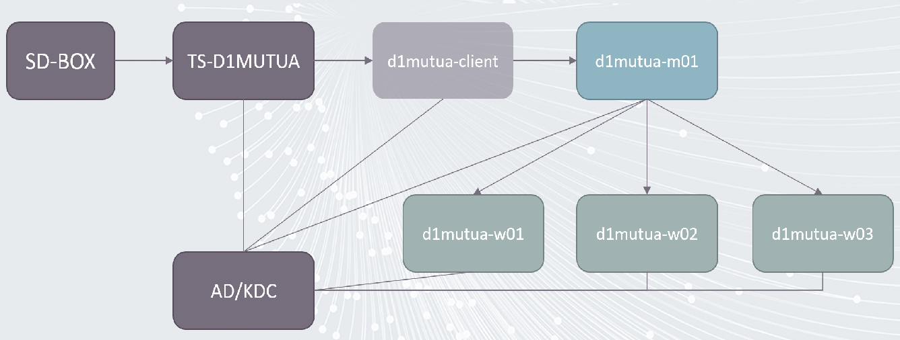

# CASD spark/hdfs cluster onboarding

This tutorial aims to help you to be familiar on how to use spark/hdfs cluster inside CASD infrastructure.

We will follow the below steps in this tutorial.

- understand the general architecture of the cluster
- check web interface access of the cluster
- check ssh access of the cluster
- check hdfs client of the cluster
- check spark client of the cluster

## 1. Architecture of the cluster

The below figure shows the general architecture of the cluster



- The `TS-D1MUTUA`: is the main server(Windows) which you connect to via the `SD-BOX`. 
- The `d1mutua-client`: is the server(debian 13) which allows you to interact with the spark/hdfs cluster.
- The `d1mutua-m01, d1mutua-w01/w02/w03`: are the servers which form the spark/hdfs cluster. The end users can not access 
    them directly, but through spark/hdfs client which are installed/configured on `d1mutua-client`.

## 2. Check web interface access of the cluster

This step happens inside the `TS-D1MUTUA` server (Windows).

You can visit the following url by using the `Firefox` web browser.

- [hdfs web interface](https://d1mutua-m01.casd.fr:50470/explorer.html) : is the web interface which allows users to view directories and data in the hdfs cluster.
- [spark web interface](https://d1mutua-m01.casd.fr:8090/cluster) : is the web interface which allows users to view spark jobs and available resources of the cluster. 

> There is a shortcut created in `Bureau`->`Raccourcis`->`Cluster`. You only need to double-click on it. A `Firefox` web browser
> will be opened automatically.
>
> The first connection may take few seconds, because of the kerberos ticket and user groups checking.
> You may also need to accept the certificat if you see warnings.
  
## 3. Check the access of d1mutua-client

This steps happens inside the `TS-D1MUTUA` server(Windows). It allows you to test if you can connect to
the `d1mutua-client` server with your kerberos ticket via ssh protocol.


### 3.1 Connect to the `d1mutua-client` server

As we mentioned before, to use the spark/hdfs cluster, you need to connect to the `d1mutua-client`server(Linux).
Users can access `d1mutua-client` server(Linux) via `ssh` protocol. 

To test the connectivity: 

- open a `powershell` terminal. 
- type the below command

```powershell
# ssh is the command
# d1mutua-client.casd.fr is the target server url
ssh d1mutua-client.casd.fr
```

> After the above command, you should see a welcoming message from `CASD`. You should also notice the header of the `powershell` terminal
changed from `C:\Users\..` to `<user-name>@d1mutua-client`. 
> 
> From now on, all the commands you entered inside this terminal will be executed on the `d1mutua-client` server(Linux). 

To disconnect from the `d1mutua-client`server(Linux), use the below command

```powershell
exit
```

> You should see the header of the `powershell` terminal changed from `<user-name>@d1mutua-client` to `C:\Users\..`.

### 3.2 Transfer data between `TS-D1MUTUA` and `d1mutua-client`  

In this section, we will learn hot to transfer data between `TS-D1MUTUA`(Windows) and `d1mutua-client`(Linux):

To facilitate the data transfer, CASD has developed two commands `kup` and `kdown`


#### 3.2.1 Use kup to upload data

The command `kup` allows us to upload data from `TS-D1MUTUA(Windows)` to `d1mutua-client(linux)` server. 

Open a new `powershell` terminal, then enter the below command

```powershell
# go to the test data folder
cd C:\Users\Public\Documents\hadoop_cluster_onboarding\data

# upload a single file
kup stats.csv d1mutua-client.casd.fr

# upload a folder 
kup -r folder2 d1mutua-client.casd.fr
```


After the data transfer, the data arrive to the server `d1mutua-client.casd.fr`. If you want to check the data, you need
to connect to the `d1mutua-client` server(Linux). Use the first terminal opened in section 3.1 and enter the commands below

```powershell
# connect to the `d1mutua-client` server
ssh d1mutua-client.casd.fr

# print your current folder path
pwd
# you should see something like /home/<your-username>

# check the uploaded data
ls 
# you should see the stats.csv file and folder2 

# disconnect from the linux server
exit
# now you are in the windows powershell terminal again
```

#### 3.2.2 Use kdown to download data

The command `kdown` allows us to `download` data from `d1mutua-client(linux)` server to `TS-D1MUTUA(Windows)`. 

Reuse the `powershell` terminal opened in section 3.2.1, then enter the below command

```powershell
# go to the test data folder
cd C:\Users\<your-username>\Documents\

# download a single file to the windows Dcouments folder
kdown d1mutua-client.casd.fr:/home/<your-username>/stats.csv .

# download a folder the windows Dcouments folder
kdown -r folder2 d1mutua-client.casd.fr:/home/<your-username>/folder2 .
```

> Open a file explorer in `TS-D1MUTUA(Windows)`, and check your Documents, you should see the file `stats.csv` and `folder2`.
> 

> 
#### 3.2.3 Get help

If you want to know more details about the two commands, you can enter the below command

```powershell
# get function description
Get-help kdown

# get function example
Get-help kdown Examples
```

> You can close this terminal if everything works well

## 4. Check the hdfs client access

For now, we only support `hdfs client under Linux`, so you need to ssh to the `d1mutua-client.casd.fr` server first.

Open a `powershell` terminal, and run the below command

```powershell
# connect to the `d1mutua-client` server
ssh d1mutua-client.casd.fr
```

> You should see a welcome message from `CASD`.
> From now on, as you are in the `d1mutua-client` server(Linux). The powershell command will not work anymore.

In `d1mutua-client` server(Linux), you have two different file system.
- local file system of `d1mutua-client` server.
- distributed file system of the `hdfs cluster`.

Run the below command to test your hdfs client.

```shell
# check the hdfs file system
hdfs dfs -ls /

# check user home folder, $USER will be replaced by the current user name
hdfs dfs -ls /users/$USER

# expected output for user D1MUTUA_P_LIU0000
drwx------+  - D1MUTUA_P_LIU0000 hadoop          0 2026-03-11 09:06 /users/D1MUTUA_P_LIU0000/.sparkStaging
-rw-------+  3 D1MUTUA_P_LIU0000 hadoop         76 2026-03-06 11:18 /users/D1MUTUA_P_LIU0000/stats.csv
drwx------+  - D1MUTUA_P_LIU0000 hadoop          0 2026-03-10 17:16 /users/D1MUTUA_P_LIU0000/tmp
```

You can also try to access the project folder

```shell
# check the projects folder
hdfs dfs -ls /projects

# try to access a project 
hdfs dfs -ls /projects/BCL_EEC
```

### 4.1 transfer data from local file system to hdfs cluster

As `spark` is a framework for distributed computing, the data must be also distributed. That's why `spark` can't use 
data from the local file system of `d1mutua-client` server. As a result, we must transfer data from `local file system` to `hdfs cluster`

Use the same terminal of section 4. The below commands run inside `d1mutua-client` server. 

```shell
# go to your home directory of `d1mutua-client` server
cd
# check data in the local file system
ls

# you should see stats.csv in the output. We copied in section 3.5.2

# now upload data  from `local file system` to `hdfs cluster`
hdfs dfs -put stats.csv /users/$USER/

# check the data in hdfs
hdfs dfs -ls /users/$USER
```

## 5. Check the spark client access

First check if you have spark installed in your environment. Use the same terminal of section 4.1. The below commands 
run inside `d1mutua-client` server. 

```shell
# check current spark runtime version
spark-submit --version

# check if you have kerberos ticket
klist

# create your first spark job
nano job1.py
```

> Put the below code in the `job1.py` file

```python
from pyspark.sql import SparkSession

def main():
    # Create Spark session
    spark = SparkSession.builder \
        .appName("pengfei_test") \
        .getOrCreate()

    # For a basic test, create a small DataFrame
    df = spark.createDataFrame([
        ("Alice", 25),
        ("Bob", 30),
        ("Charlie", 35)
    ], ["name", "age"])

    df.show()

    # Just for validation: print row count
    print(f"Total rows: {df.count()}")

    spark.stop()

if __name__ == "__main__":
    main()
```

> use `ctrl+o` for saving file. ctrl+x for exiting.

Now we can submit the job to the cluster with the below command

```shell
spark-submit --name=pengfei_test_job job1.py
```

> By default, we have configured the spark client in mode cluster. So nothing runs in `d1mutua-client.casd.fr`. As a result, you don't need to install python environment and pyspark
> You can check the status of your job via [yarn web UI](https://d1mutua-m01.casd.fr:8090/cluster).


### 5.1 Use spark cluster in interactive mode

We have seen how to submit job to the cluster. For exploring data, you may want to your spark job interactively(client mode). 
In this mode the `spark driver` runs on `d1mutua-client.casd.fr`. So we need to install a `python virtual environment and pyspark`

Use the same terminal of section 5. The below commands run inside `d1mutua-client` server. 

```shell
# check your python version
python3 -V

# create a virtual env
python3 -m venv spark_venv

# activate the python venv
source spark_venv/bin/activate

# check installed libs
pip list

# install pyspark, the pyspark version must match the spark version in the cluster
pip install pyspark==3.5.7

# install jupyterlab
pip install jupyterlab
```

To facilitate the usage of jupyterlab, CASD has developed a launcher to avoid port conflict between users. 
To start a jupyterlab, you can run

```shell
run_jupyterlab

# expected output
INFO: Using port: 8888
INFO: JupyterLab server runs with URL: http://d1mutua-client:8888/lab?token=79b0a30a9a2fc6adae67...482d4a77ea70d
INFO: To stop the JupyterLab, use ctrl+C or close the terminal.
```

You need to copy the jupyterlab url and open it with a browser in `TS-D1MUTUA`.


