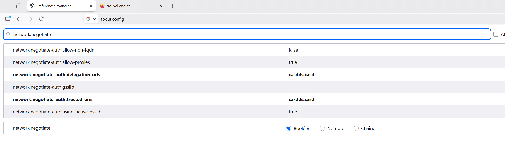

# Enable kerberos auth in web browser

## 1. kerberos authentication for Firefox

To enable automatic kerberos authentication in Firefox, you can directly change the parameters of your firefox. 
The below steps must work on all OS.

### 1.1 Access the firefox configuration page

Open your Firefox on the client computer, type `about:config` in the address field.

### 1.2 Check the krb authentication config

In the search bar, type `network.negotiate`, you should find config parameters such as
- `network.negotiate-auth.trusted-uris`
- `network.negotiate-auth.delegation-uris` 

The below figure shows an example:


### 1.3. setup uris

The most important attributes are `network.negotiate-auth.trusted-uris` and `network.negotiate-auth.delegation-uris` 
you should enter the hostname(e.g. nn.casd.fr, dn1.casd.fr) of the on-premises gateway, and then click OK.


> You can type the hostnames of several on-premises gateways, separating them with commas. 
> To include all the on-premises gateways that support Kerberos authentication in the AD domain, 
> type the AD domain name starting with a dot, for example, `.casd.fr`.
> 
> 
> 
## 2. Kerberos authentication for Chrome

### 2.1 For Windows

`Chrome automatically supports Kerberos via Windows SSPI.` You do NOT configure inside Chrome.

Instead, you need to configure Windows policy:

```text
# open windows serach bar and type
gpedit.msc

# you should see a popup window
Navigate to:

Computer Configuration
 → Administrative Templates
 → Google
 → Google Chrome
 
# you need to find the parameter `AuthServerAllowlist`, then put the wildcard of the domain which you want to trust
*.casdds.casd

# This is equivalent to Firefox’s:
network.negotiate-auth.trusted-uris = .casdds.casd
```

> You need to restart Chrome completely.

For a Quick Test, you can use the below command to launch `Chrome`

```powershell
chrome.exe --auth-server-allowlist="*.casdds.casd"

# if you want delegation
chrome.exe --auth-server-allowlist="*.casdds.casd" --auth-negotiate-delegate-allowlist="*.casdds.casd"
```


### 2.2 For Linux


If your run `Chrome` on Linux, you must launch Chrome with:

```shell
google-chrome --auth-server-allowlist="*.casdds.casd"

```

Or configure `/etc/opt/chrome/policies/managed/kerberos.json`:
```json
{
  "AuthServerAllowlist": "*.casdds.casd"
}
```

### 2.3 For MacOS

If your run `Chrome` on MacOS, you must run the below command:

```shell
defaults write com.google.Chrome AuthServerAllowlist "*.casdds.casd"
```

## Test your apps

HDFS : https://deb13-spark1.casdds.casd:50470

YARN: https://deb13-spark1.casdds.casd:8090

> The port number may be different, you need to check them with your cluster administrator

