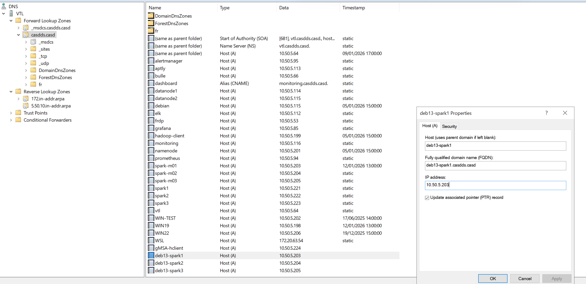
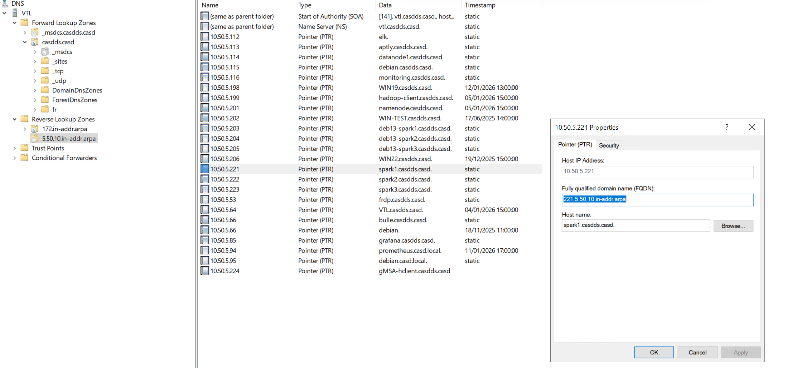

# Integrate kerberos in name node
In this tutorial, we will show how to integrate kerberos into the hadoop cluster.

We suppose the cluster has three nodes:
- namenode: 10.50.5.203 deb13-spark1
- datanode: 10.50.5.204 deb13-spark2
- datanode: 10.50.5.205 deb13-spark3

This tutorial is tested with hadoop 3.3.6 to create a hdfs and yarn cluster. I have one namenode 
and two datanodes, we are using AD/KDC to ensure Kerberos, each node already have an gMSA account.

Here, we suppose all nodes already have necessary `Kerberos client config` and valid `.keytab file`.


## 1. Pre-requis NTP

Kerberos is extremely sensitive to `clock drift` and `hostname mismatch`. So we must synchronize clocks on all nodes:

```shell
sudo apt install chrony
sudo systemctl enable chrony
sudo systemctl start chrony
chronyc tracking
```

> Time drift should be < 1 second.

## 2. Pre-requis server hostname
The server hostname is very important if you want to use kerberos, it will be used by the KDC server to authenticate
the server.

To set the hostname on each server, you can use below command
```shell
# the general form is 
sudo hostnamectl set-hostname <new-hostname>

# in our case
sudo hostnamectl set-hostname deb13-spark1

# set the value for /etc/hosts
vim /etc/hosts
# remove the default host config if there are any, it may cause the datanode unable to connect to the namenode 
127.0.0.1 localhost

# add the below lines
10.50.6.203	    deb13-spark1.casdds.casd	deb13-spark1
10.50.6.204     deb13-spark2.casdds.casd    deb13-spark2
10.50.6.205     deb13-spark3.casdds.casd    deb13-spark3

# test the hostname, run below command on each server
hostname 

# test the connectivity, run below command on each server
ping deb13-spark1.casdds.casd
```

### 2.1 change dns setting

As we will use AD as our dns, so we need to change the dns setting too. Suppose the AD runs at 10.50.5.64.
You need to configure `/etc/resolv.conf` as below.
```shell
sudo vim /etc/resolv.conf

# add below lines
nameserver 10.50.5.64
# google dns for internet
nameserver 8.8.8.8
```
## 3. Pre-requis DNS

As we use DNS(AD) as our DNS, we need to create the `dns forward lookup entries` and the `reverse lookup entries(PTR)`

The below figure shows the DNS config interface:


The below figure shows the `dns forward lookup entries` example:


The below figure shows the `reverse lookup entries` example:



> The objective of this step is to make the three server recognizable by the AD, and KDC.

## 4. Pre-requis AD

Account creation in AD is essential for KDC to generate the `right ticket kerberos` for the `right host` with right `SPN(service 
principal name)`

### 4.1 Service Principal Name definition
In the kerberos best practice, each service should have its own SPN. For the namenode, we should have at least three
Service Principals  
- host/master1.exemple.com@EXEMPLE.COM
- hdfs/master1.exemple.com@EXEMPLE.COM      # HDFS NameNode/DataNode & YARN ResourceManager
- HTTP/master1.exemple.com@EXEMPLE.COM      # Web UI HTTPS

> These SPN can be individual accounts in AD, or multiple SPNs in one gMSA account.
> 
### 4.1 Keytab file configuration

Here we don't consider the `.keytab file of gMSAd`, we only consider the keytab files which allow the hadoop cluster to
work with kerberos.

As we mentioned before, the ssh requires the host principal keytab file must be located at `/etc/krb5.keytab`. You can 
not put it in another path or name.

For the name node(deb13-spark1), I only need one keytab file

```shell
# main host keytab of the name node
sudo klist -kt /etc/krb5.keytab
# expected output
Keytab name: FILE:/etc/krb5.keytab
KVNO Timestamp           Principal
---- ------------------- ------------------------------------------------------
   1 02/10/2026 13:51:18 deb13-spark1$@CASDDS.CASD
   1 02/10/2026 13:51:18 deb13-spark1$@CASDDS.CASD
   1 02/10/2026 13:51:18 host/deb13-spark1.casdds.casd@CASDDS.CASD
   1 02/10/2026 13:51:18 host/deb13-spark1.casdds.casd@CASDDS.CASD
   1 02/10/2026 13:51:18 HTTP/deb13-spark1.casdds.casd@CASDDS.CASD
   1 02/10/2026 13:51:18 HTTP/deb13-spark1.casdds.casd@CASDDS.CASD
   1 02/10/2026 13:51:18 hdfs/deb13-spark1.casdds.casd@CASDDS.CASD
   1 02/10/2026 13:51:18 hdfs/deb13-spark1.casdds.casd@CASDDS.CASD
```

For the data node(deb13-spark1), I need the `keytab file for name node principal`, and 
`keytab file for data node principal`

```shell
# main host keytab of the data node
sudo klist -kt /etc/krb5.keytab
# expected output
Keytab name: FILE:/etc/krb5.keytab
KVNO Timestamp           Principal
---- ------------------- ------------------------------------------------------
   1 02/10/2026 15:17:25 deb13-spark2$@CASDDS.CASD
   1 02/10/2026 15:17:25 deb13-spark2$@CASDDS.CASD
   1 02/10/2026 15:17:25 host/deb13-spark2.casdds.casd@CASDDS.CASD
   1 02/10/2026 15:17:25 host/deb13-spark2.casdds.casd@CASDDS.CASD
   1 02/10/2026 15:17:25 HTTP/deb13-spark2.casdds.casd@CASDDS.CASD
   1 02/10/2026 15:17:25 HTTP/deb13-spark2.casdds.casd@CASDDS.CASD
   1 02/10/2026 15:17:25 hdfs/deb13-spark2.casdds.casd@CASDDS.CASD
   1 02/10/2026 15:17:25 hdfs/deb13-spark2.casdds.casd@CASDDS.CASD


# keytab file of the name node
sudo klist -kt /etc/security/keytabs/deb13-spark1.keytab
# expected output
Keytab name: FILE:/etc/security/keytabs/deb13-spark1.keytab
KVNO Timestamp           Principal
---- ------------------- ------------------------------------------------------
   1 02/10/2026 13:51:18 deb13-spark1$@CASDDS.CASD
   1 02/10/2026 13:51:18 deb13-spark1$@CASDDS.CASD
   1 02/10/2026 13:51:18 host/deb13-spark1.casdds.casd@CASDDS.CASD
   1 02/10/2026 13:51:18 host/deb13-spark1.casdds.casd@CASDDS.CASD
   1 02/10/2026 13:51:18 HTTP/deb13-spark1.casdds.casd@CASDDS.CASD
   1 02/10/2026 13:51:18 HTTP/deb13-spark1.casdds.casd@CASDDS.CASD
   1 02/10/2026 13:51:18 hdfs/deb13-spark1.casdds.casd@CASDDS.CASD
   1 02/10/2026 13:51:18 hdfs/deb13-spark1.casdds.casd@CASDDS.CASD
```

Check the keytab and principal validity.

Hadoop requires the service principal must have the below structure

```shell
# general form
service/FQDN@REALM

# for example
hdfs/deb13-spark1.casdds.casd@CASDDS.CASD
```

The breakdown of the principal:
- service name: hdfs
- FQDN/canonical hostname: deb13-spark1.casdds.casd
- Realm: CASDDS.CASD

In your hdfs-site.xml, you may see config like `hdfs/_HOST@CASDDS.CASD`, this works because at runtime `Hadoop 
replaces _HOST with acutal server FQDN`. For example in deb13-spark1, the principal will be `hdfs/deb13-spark1.casdds.casd@CASDDS.CASD`.
This prevents hardcoding url per node.

> You need to make sure the hostname matches exactly the DNS, if not kerberos fails.
> You can get your hostname in linux with `hostname -f`. The output value must be the same in the DNS(and reverse DNS).

The last thing, all the SPNs must exist in AD/KDC, if not, you will get `Server not found in Kerberos database`

## 5. Service name convention in this tutorial

You can notice we only have three SPNs in the keytab file.
- HTTP: WebUI
- hdfs: hdfs, yarn
- host: ssh, sssd

## 6. Hadoop cluster in secure mode.

When we enable the kerberos authentication, the Hadoop cluster is configured to run in secure mode. It means
- the sasl rpc must be enabled
- the executer-container must be secured(we will learn how to do this in the `yarn configuration chaipter`)

To enable `SASL RPC data transfer with non-privileged ports`, you can check the [chapiter 07](./07.enable_sasl_rpc_in_hadoop.md)


## 7. Integrate kerberos in core-site.xml

The conf file `core-site.xml` contains settings that are `common to all Hadoop components`
(e.g.HDFS, YARN, MapReduce, Spark, Hive, etc.).

Key properties you’ll commonly see:
- `fs.defaultFS`: Default filesystem URI (tells everyone where HDFS is). Example value: `hdfs://namenode-host:8020`
- `hadoop.tmp.dir`: Base temporary directory (very important). Example value: `/app/hadoop/tmp`
- `io.compression.codecs`: Compression codecs available. Example value: `Snappy, Zlib, LZ4, etc.`
- `hadoop.proxyuser.*`: For proxy users (Hue, Oozie, Spark, etc.)
- `fs.trash.interval`: How long deleted files stay in trash. Example value: 4320 (3 days)

```xml
<?xml version="1.0" encoding="UTF-8"?>
<?xml-stylesheet type="text/xsl" href="configuration.xsl"?>

<configuration>
    <!-- basic core-site configuration -->
    <property>
        <name>fs.defaultFS</name>
        <value>hdfs://deb13-spark1.casdds.casd:9000</value>
    </property>
    <property>
        <name>hadoop.tmp.dir</name>
        <value>file:///home/hadoop/tmp</value>
    </property>
    <property>
        <name>io.file.buffer.size</name>
        <value>16384</value>
    </property>
    <!-- Enable hadoop kerberos authentication -->
    <property>
        <name>hadoop.security.authentication</name>
        <value>kerberos</value>
    </property>

    <property>
        <name>hadoop.security.authorization</name>
        <value>true</value>
    </property>

    <!-- Group resolution via OS / SSSD -->
    <property>
        <name>hadoop.security.group.mapping</name>
        <value>org.apache.hadoop.security.ShellBasedUnixGroupsMapping</value>
    </property>

    <!-- Enable hadoop SPNEGO for Web UIs -->
    <property>
        <name>hadoop.http.authentication.type</name>
        <value>kerberos</value>
    </property>

    <property>
        <name>hadoop.http.authentication.kerberos.principal</name>
        <value>HTTP/_HOST@CASDDS.CASD</value>
    </property>

    <property>
        <name>hadoop.http.authentication.kerberos.keytab</name>
        <value>/etc/krb5.keytab</value>
    </property>
    <property>
        <name>hadoop.http.filter.initializers</name>
        <value>org.apache.hadoop.security.AuthenticationFilterInitializer</value>
    </property>

    <!-- AD principal → local user mapping -->
    <property>
        <name>hadoop.security.auth_to_local</name>
        <value>
            RULE:[2:$1@$0](.*@CASDDS\.CASD)s/@CASDDS\.CASD// RULE:[1:$1] DEFAULT
        </value>
        <description>Mapping du principal Kerberos vers le nom d’utilisateur local.</description>
    </property>
    <!-- enable sasl rpc -->
    <property>
        <name>hadoop.ssl.server.conf</name>
        <value>ssl-server.xml</value>
    </property>
</configuration>


```

### 7.1 Mapping between Kerberos principal and local Unix username

You can notice the most complex property in `core-site.xml` is `hadoop.security.auth_to_local`. This property defines
how hadoop `convert a Kerberos principal into a local Unix username`.

In general, we have two forms of principals
- primary/instance@REALM : hdfs/spark1.casdds.casd@CASDDS.CASD -> hdfs (after conversion)
- username@REALM : pliu@CASDDS.CASD -> pliu (after conversion)

As a result, we need two different rules to do convertion. Each rule has 3 parts:
```text
# general form
RULE:[component extraction](match regex)substitution

# for example rule1
RULE:[2:$1@$0](.*@CASDDS\.CASD)s/@CASD\.CASD//

# rule2
RULE:[1:$1]

# rule3 
DEFAULT
```
#### Rule 1 explanation
In rule1, we have three parts.

In `Part1`, we do component extraction. For a kerberos principal `primary/instance@realm`, hadoop consider component as
`$1/$2@$0`. So we can have the below mapping:
- $1 = primary
- $2 = instance (if present)
- $0 = realm

For example
- for principal `pliu@CASDDS.CASD`: `$1=pliu`, `$0=CASDDS.CASD`
- for principal `hdfs/spark1.casdds.casd@CASDDS.CASD`: `$1=hdfs`, `$2=spark1.casdds.casd`, `$0=CASDDS.CASD`
As a result, after part1, the input principal will be converted to `pliu@CASDDS.CASD` or `hdfs@CASDDS.CASD`

In `Part2`, we check if the principal matches to the given regex. With the regex such as `(.*@CASDDS\.CASD)`, we check
if the principal is for the Realm `CASDDS.CASD`. If realm matches, then go to part3. If realm not matches, the rule is
skipped

In `Part3`, we do a regex substitution. With the regex such as `s/@CASD\.CASD//`, we will remove the realm suffix. So
`pliu@CASDDS.CASD` -> `pliu` or `hdfs@CASDDS.CASD` -> `hdfs`.

#### Rule 2 explanation

In rule2, we only have the `component extraction part`. It says only use the `$1(primary)` part of the principal
- for principal `pliu@CASDDS.CASD`: it returns `pliu`
- for principal `hdfs/spark1.casdds.casd@CASDDS.CASD`: it returns `hdfs`


#### Rule 3 explanation
In rule3, we have only `DEFAULT`. It means `Hadoop uses the full principal unchanged.`


#### Rule order matters

Rule1 applies first, then Rule 2, then Rule3

- For all principals in realm CASDDS.CASD, rule 1 will be applied, and the value of `$1(primary)` will be returned.
- For all principals that are from foreign realm(e.g. OTHER.REALM), rule 1 will be failed, because regex not match, then rule 2
will be applied, and the value of `$1(primary)` will be returned.
- The `DEFAULT` never applies.

#### Test your rules

You can use the below command to test the output of your rules

```shell
hadoop org.apache.hadoop.security.HadoopKerberosName alice@CASD.FR
Name: alice@CASD.FR to alice

hadoop org.apache.hadoop.security.HadoopKerberosName alice@CASDDS.CASD
Name: alice@CASDDS.CASD to alice

hadoop org.apache.hadoop.security.HadoopKerberosName hdfs/deb13-spark1.casdds.casd@CASDDS.CASD
# output
Name: hdfs/deb13-spark1.casdds.casd@CASDDS.CASD to hdfs

```


## 8. Edit the hdfs-site.xml

The `hdfs-site.xml` file controls everything related to HDFS (NameNode, DataNode, JournalNode, etc.).
Key properties you will commonly see:
- `dfs.replication`: Default replication factor (usually 3)
- `dfs.namenode.name.dir`: Where NameNode stores metadata (fsimage + edits)
- `dfs.datanode.data.dir`: Where DataNodes store actual blocks
- `dfs.blocksize`: Default block size (128MB or 256MB in modern clusters)
- `dfs.namenode.http-address`: Web UI of NameNode
- `dfs.ha.*`: High Availability settings (for HA clusters)
- `dfs.permissions.enabled`: Whether permission checking is on

> **dfs.datanode.data.dir/dfs.data.dir(old version)** : Determines where on the local filesystem an DFS data node should store its blocks. If this is a 
 comma-delimited list of directories, then data will be stored in all named directories, typically on different devices. 
 Directories that do not exist are ignored.

For the `hadoop 3.3.*`, you can use the below conf

For the `namenode`, edit `hdfs-site.xml` add the following lines

```xml
<?xml version="1.0" encoding="UTF-8"?>
<configuration>
    <!-- basic HDFS conf -->
    <property>
        <name>dfs.replication</name>
        <value>2</value>
    </property>

    <property>
        <name>dfs.namenode.name.dir</name>
        <value>file:///home/hadoop/hdfs/namenode</value>
    </property>

    <property>
        <name>dfs.namenode.checkpoint.dir</name>
        <value>file:///home/hadoop/hdfs/secondary</value>
    </property>

    <property>
        <name>dfs.block.access.token.enable</name>
        <value>true</value>
    </property>

    <!-- HDFS permissions -->
    <property>
        <name>dfs.permissions.enabled</name>
        <value>true</value>
    </property>

    <!-- NameNode Kerberos identity -->
    <property>
        <name>dfs.namenode.kerberos.principal</name>
        <value>hdfs/_HOST@CASDDS.CASD</value>
    </property>

    <property>
        <name>dfs.namenode.keytab.file</name>
        <value>/etc/krb5.keytab</value>
    </property>

    <!-- Secondary NameNode / Checkpoint -->
    <property>
        <name>dfs.secondary.namenode.kerberos.principal</name>
        <value>hdfs/_HOST@CASDDS.CASD</value>
    </property>

    <property>
        <name>dfs.secondary.namenode.keytab.file</name>
        <value>/etc/krb5.keytab</value>
    </property>

    <!-- SPNEGO authentication for Web UI -->
    <property>
        <name>dfs.web.authentication.kerberos.principal</name>
        <value>HTTP/_HOST@CASDDS.CASD</value>
    </property>

    <property>
        <name>dfs.web.authentication.kerberos.keytab</name>
        <value>/etc/krb5.keytab</value>
    </property>
    <!-- SASL encryption for block transfer -->
    <property>
        <name>dfs.data.transfer.protection</name>
        <value>authentication</value>
    </property>

    <!-- Non privileged ports -->
    <property>
        <name>dfs.https.server.keystore.resource</name>
        <value>ssl-server.xml</value>
    </property>

    <property>
        <name>dfs.https.port</name>
        <value>50470</value>
    </property>

    <property>
        <name>dfs.secondary.https.port</name>
        <value>50490</value>
        <description>Port HTTPS pour le secondary-namenode.</description>
    </property>
    <property>
        <name>dfs.https.address</name>
        <value>deb13-spark1.casdds.casd:50470</value>
        <description>Adresse HTTPS d’écoute du Namenode.</description>
    </property>
    <property>
        <name>dfs.encrypt.data.transfer</name>
        <value>true</value>
    </property>

    <!-- Explicitly force HTTP -->
    <property>
        <name>dfs.http.policy</name>
        <value>HTTPS_ONLY</value>
    </property>
    <!-- Superuser group -->
    <property>
        <name>dfs.permissions.superusergroup</name>
        <value>hadoop</value>
    </property>
</configuration>
```

For the data node 1(deb13-spark2), below is a simple example of `hdfs-site.xml`

```xml
<?xml version="1.0" encoding="UTF-8"?>
<configuration>
    <!-- basic HDFS data node conf -->
    <property>
        <name>dfs.replication</name>
        <value>2</value>
    </property>

    <property>
        <name>dfs.datanode.data.dir</name>
        <value>file:///home/hadoop/hdfs/datanode</value>
    </property>
    <!-- Enable Kerberos authentication -->
    <property>
        <name>dfs.permissions.enabled</name>
        <value>true</value>
    </property>

    <property>
        <name>dfs.block.access.token.enable</name>
        <value>true</value>
    </property>
    <!-- NameNode Kerberos identity -->
    <property>
        <name>dfs.namenode.kerberos.principal</name>
        <value>hdfs/deb13-spark1.casdds.casd@CASDDS.CASD</value>
    </property>

    <!-- DataNode Kerberos identity -->
    <property>
        <name>dfs.datanode.kerberos.principal</name>
        <value>hdfs/deb13-spark2.casdds.casd@CASDDS.CASD</value>
    </property>

    <property>
        <name>dfs.datanode.keytab.file</name>
        <value>/etc/krb5.keytab</value>
    </property>

    <!-- SPNEGO authentication for Web UI -->
    <property>
        <name>dfs.web.authentication.kerberos.principal</name>
        <value>HTTP/deb13-spark2.casdds.casd@CASDDS.CASD</value>
    </property>

    <property>
        <name>dfs.web.authentication.kerberos.keytab</name>
        <value>/etc/krb5.keytab</value>
    </property>
    <!-- SASL encryption for block transfer -->
    <property>
        <name>dfs.data.transfer.protection</name>
        <value>authentication</value>
    </property>

    <!-- enable sasl rpc  -->
    <property>
        <name>dfs.https.server.keystore.resource</name>
        <value>ssl-server.xml</value>
    </property>

    <!-- specify the name node https url and ports  -->
    <property>
        <name>dfs.https.port</name>
        <value>50470</value>
    </property>


    <property>
        <name>dfs.https.address</name>
        <value>deb13-spark1.casdds.casd:50470</value>
        <description>Adresse HTTPS d’écoute du Namenode.</description>
    </property>

    <property>
        <name>dfs.secondary.https.port</name>
        <value>50490</value>
        <description>Port HTTPS pour le secondary-namenode.</description>
    </property>
    
    <property>
        <name>dfs.encrypt.data.transfer</name>
        <value>true</value>
    </property>


    <!-- Explicitly force HTTP -->
    <property>
        <name>dfs.http.policy</name>
        <value>HTTPS_ONLY</value>
    </property>
    <!-- Superuser group -->
    <property>
        <name>dfs.permissions.superusergroup</name>
        <value>hadoop</value>
    </property>
</configuration>

```
For the data node 2(deb13-spark3), below is a simple example of `hdfs-site.xml`
```xml
<?xml version="1.0" encoding="UTF-8"?>
<configuration>
    <!-- basic data node config -->
    <property>
        <name>dfs.replication</name>
        <value>2</value>
    </property>

    <property>
        <name>dfs.datanode.data.dir</name>
        <value>file:///home/hadoop/hdfs/datanode</value>
    </property>

    <!-- Enable block security -->
    <property>
        <name>dfs.block.access.token.enable</name>
        <value>true</value>
    </property>

    <!-- HDFS permissions -->
    <property>
        <name>dfs.permissions.enabled</name>
        <value>true</value>
    </property>

    <!-- NameNode Kerberos identity -->
    <property>
        <name>dfs.namenode.kerberos.principal</name>
        <value>hdfs/deb13-spark1.casdds.casd@CASDDS.CASD</value>
        <description>The principal the NameNode uses to login. _HOST automatically resolves to the FQDN.</description>
    </property>

    <!-- DataNode Kerberos identity -->
    <property>
        <name>dfs.datanode.kerberos.principal</name>
        <value>hdfs/_HOST@CASDDS.CASD</value>
    </property>

    <property>
        <name>dfs.datanode.keytab.file</name>
        <value>/etc/krb5.keytab</value>
    </property>

    <!-- SPNEGO authentication for Web UI -->
    <property>
        <name>dfs.web.authentication.kerberos.principal</name>
        <value>HTTP/_HOST@CASDDS.CASD</value>
    </property>

    <property>
        <name>dfs.web.authentication.kerberos.keytab</name>
        <value>/etc/krb5.keytab</value>
    </property>
    <!-- SASL encryption for block transfer -->
    <property>
        <name>dfs.data.transfer.protection</name>
        <value>authentication</value>
    </property>

    <!-- Non privileged ports -->
    <property>
        <name>dfs.https.server.keystore.resource</name>
        <value>ssl-server.xml</value>
    </property>

    <!-- Name node https url and ports -->
    <property>
        <name>dfs.https.port</name>
        <value>50470</value>
    </property>
    
    <property>
        <name>dfs.https.address</name>
        <value>deb13-spark1.casdds.casd:50470</value>
        <description>Adresse HTTPS d’écoute du Namenode.</description>
    </property>
    
    <property>
        <name>dfs.secondary.https.port</name>
        <value>50490</value>
        <description>Port HTTPS pour le secondary-namenode.</description>
    </property>
    
    <property>
        <name>dfs.encrypt.data.transfer</name>
        <value>true</value>
    </property>

    <!-- Explicitly force HTTP -->
    <property>
        <name>dfs.http.policy</name>
        <value>HTTPS_ONLY</value>
    </property>
    <!-- Superuser group -->
    <property>
        <name>dfs.permissions.superusergroup</name>
        <value>hadoop</value>
    </property>
</configuration>
```
